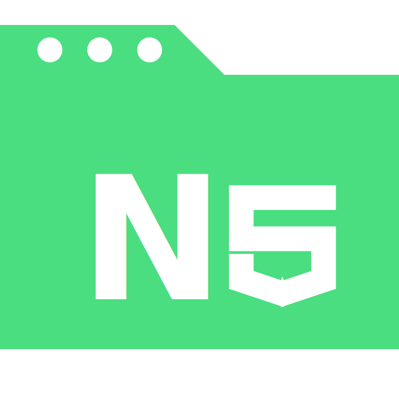

<table>
  <tr>
    <td></td>
    <td><h1 style="margin: 0;">NextSchool</h1></td>
  </tr>
</table>

NextSchool is an AI-based platform designed to enhance the educational experience for students and teachers. Our goal is to provide a seamless and interactive learning environment with AI capabilities. The AI (ChatGPT-4.0) is fine-tuned to REB STEM books and REB, NESA National examination question papers, which gives it the ability to explain concepts in the REB curriculum tone and level, help students revise content, answer questions, and assist teachers or students in generating REB/NESA STEM-like questions and answers.

## Features

- **Interactive Lessons**: Engaging and interactive lessons to make learning fun.
- **Progress Tracking**: Monitor student progress and provide feedback.
- **Resource Library**: Access to a wide range of educational resources.
- **AI Assistance**: AI-powered explanations and question generation based on REB STEM books and examination papers.

## Tech Stack

- **Frontend**: , 
- **Backend**: , 
- **Database**: 
- **Version Control**: 
- **Hosting**: 
- **AI Model**:  (Fine-tuned)

## Dashboard Preview

## NextSchool Icons

### Solid:

  

### Outline:

  

## Contact Us

For any inquiries or feedback, please contact us at [yvesmugisha09@gmail.com](mailto:yvesmugisha09@gmail.com).

## Inspiring Quotes

> "Education is the most powerful weapon which you can use to change the world."  
> **- Nelson Mandela**

> "The beautiful thing about learning is that no one can take it away from you."  
> **- B.B. King**

> "Success is not the key to happiness. Happiness is the key to success. If you love what you are doing, you will be successful."  
> **- Albert Schweitzer**

> "Learning is a treasure that will follow its owner everywhere."  
> **- Chinese Proverb**

> "Education is not the filling of a pail, but the lighting of a fire."  
> **- William Butler Yeats**

> "Coding is a journey of endless discovery, where every bug is a lesson and every solution is a triumph."  
> **- Yves DC**
